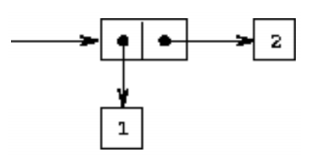
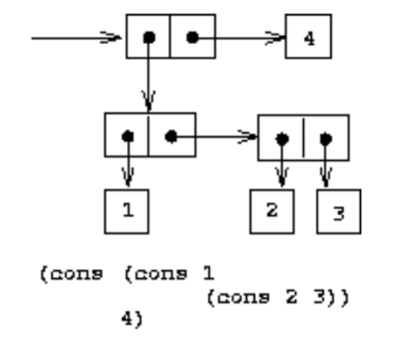
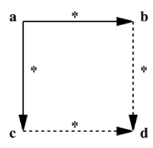
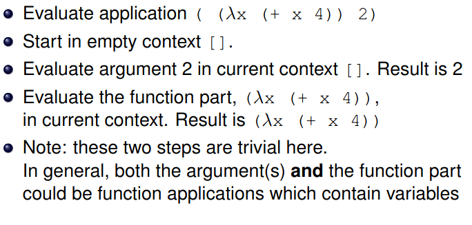
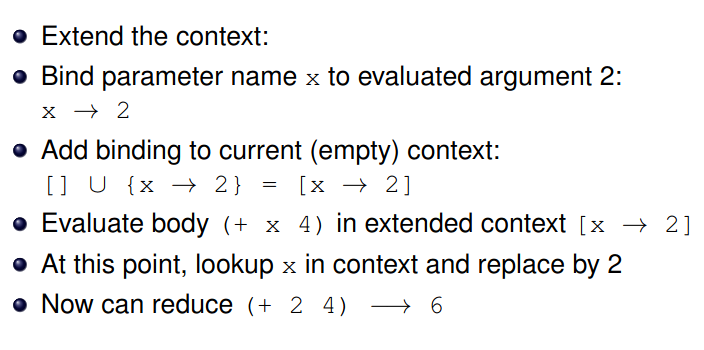

# CMPUT 325

## Lecture 2: Fun language
### Fun
- List elements are seperated by a space
- In general, f( (x1 ... xn) ) --> x, notice the spacing for parameters
- `first( L )` returns first element of L, error if L is not a list or an empty list
- `rest( L )` returns L without the first element in L, error if L is not a list or an empty list
- Using compositions of calls to `first` (or `f`) and `rest` (or `r`), we can get any component (atom or sublist) from a given list, regardless of its depth
- For brevity, `f(f(r(L)))` can be written as `ffr(L)`
- `cons( x, L )` returns a new list K = (x y1 y2 y3 ... yn) where x is an atom and L = (y1 y2 y3 ... yn)
- In theory, there is a way to define any primitive function from scratch.
- Assume we have the following primitive functions:
  - Arithmetic: +, -, *, /, and so on
  - Comparators
  - `if`, `then`, `else`
  - `null(x)`
    - `true` iff `x` is an empty list
  - `atom(x)`
    - `true` iff `x` is an atom
  - `eq(x, y)`
    - `true` iff `x` and `y` are the same atom
    - `eq( a,a )` returns true
    - `eq( a,b )` returns false
    - `eq( (a), (a) )` returns false because the arguments are lists
- Similar idea is used to create RISC syntax.
- Remarks:
  - No notion of variable-as-storage
  - No assignment statement as in procedural languages
  - No loop constructs
  - **Recursion** as the only mechanism to define non-trivial functions
- 1-step evaluation = replacement + substitution
- Examples covered:
  `length( L )`, `append( L1, L2 )`, `last( L )`, `removeLast( L )`
- It makes sense to break the solution into smaller functions
- One function must do only one thing

## Lecture 2: Intro to LISP
* `reverse( L )` using `append( L1, L2 )`
* Abstract data type for binary tree
  * Goal: implement a binary tree and some operations, such as inserting elements
  * Two main tasks:
    * Decide how trees are represented by lists
    * Implement an abstract data type for binary trees and the operations on them
  * User will work with trees using only these functions. The user is protected from the details of our data representation
  * Bottom up construction
* Binary tree representation
  * Empty tree: `nil`
  * Nonempty tree: `(left-subtree, node-value, right-subtree)`
  * Selectors:
    * `leftTree( Tr ) = f( Tr )`
    * `rightTree( Tr ) = f( r( r( Tr ) ) )`
    * `nodeValue( Tr ) = f( r( Tr ) )`
  * Constructors:
    * `consNilTr() = nil`
      * return an empty tree
    * `consTree(L, V, R) = cons( L, cons( V, cons( R, nil ) ) )`
      * construct tree with subtrees L, R and value V
  * Test: 
    * `isEmpty( Tr ) = eq( Tr, nil )`
    * return true iff `Tr` is an empty tree
* Building an abstract data type
  * Functions are the only ones that need direct knowledge of our tree representation
  * Everything else can be implemented in terms of these basic functions - providing such a base set of functions is the essence of implementing an abstract data type in functional programming

* `insert` into tree
  * assume our trees contain integer values and are sorted such that every value in the left subtree < node value < all values in right subtree
  * unique values
  * `insert( Tr, int )` inserts `int` into the binary tree `Tr`

    ```
     insert(Tr, int) = 
      if isEmpty(Tr)
        then consTree(consNilTr(), Int, consNilTr())
      else if Int = nodeValue(Tr)
        then Tr
      else if Int < nodeValue(Tr)
        then consTree(insert(leftTree(Tr), Int, nodeValue, Tr), rightTree(Tr))
      else consTree(leftTree(Tr), nodeValue(Tr), insert(rightTree(Tr), Int))
    ```

### LISP

* interpreted language
* case **insensitive**
* uses read-eval-print-loop (REPL) similar to a shell such as bash
  - read input
  - evaluate input
  - print result of evaluation
  - loop back to beginning
* Functions are defined by 
  ```
  (defun function-name parameter-list body)
  ```
  * Example: 
    - Function definition: `(defun plus (x y) (+ x y))`
    - Function application: `(plus 3 4)`
* Lisp always interprets `(e1 e2 e3 ...)` as a function application. Use quote to "atomify" the expression
* An empty list is represented by either `()` or `nil`. Both are considered the same atom in Lisp.
* `nil` also represents false
* `T` represents true

## Lecture 4
* `(if condition then-part else-part)` is a special function because not every block is run, unlike other functions
* `trace` to see calls and returns to specific functions
* `untrace` stops the tracing
* functions can take variable number of arguments
* `(let ((x 3) (y 4)) (* (+ x y) x))` evaluates expression, but replaces names `x` and `y` with their values 3 and 4
* `let` does not allow using one variable to define another, use `let*` instead
* `eq` is true iff both are equal _atoms_, runs in a single machine instruction
* `equal` is more general
* ```
  (cond (P1 S1)
        (P2 S2)
        (P3 S3)
        ...
        (T Sn)
  )
  ```
* General form of `cond` (do not use it):
  ```
  (cond (P1 S11 S12 ... S1m)
  (P2 S21 S22 ... S2m)
  ...
  (T Sn1 Sn2 ... Snm)
  )
  ```
  * If `P1` is true then evaluate `S11`, `S12`, ... and `S1m` and return the result of evaluating `S1m`

* `list`
* `caar`, `cddadr`, etc.
* `print` and `format` for printing, strings
* `random`
* Use `quote` when everything is constant
* Use `list` when some contents are the result of evaluating functions
* Use `cons` 
  * for the result in recursion when you have computed a first element and the rest of a list
  * for dotted pairs
* `(car (cdr (car (cdr (cdr (cdr L)))))) = (cadr (cadddr L))`
  * max 4 levels deep
* Simple printing `(print arg)`
* Formatted printing: `(format t format-string arg1 ...)`
* `(random N)` generates a uniformly random integer from 0..N-1 if N is an integer
* `(random F)` generates a uniformly random floating point number in range [0..F)
* Accumulators
  * helper function with an extra parameter
  * the extra parameter accumulates the required result
  * Issues with simple recursion:
    * no real computation until hits the base case
    * all computation happens on return from recursion
  * Example 1: `reverse` using an accumulator
    ```
    (defun reverse_helper (L ResultSoFar)
      (if (null L)
        ResultSoFar
        (reverse_helper (cdr L)
          (cons (car L) ResultSoFar))
        )
      )

    (defun reverseAC (L)
      (reverse_helper L nil)
      )
    ```
  * Comparing accumulator with standard recursion
    * Standard recursion on a list
      * recurse to the end of list
      * compute result on return from recursion
      * bottom-up computation
    * Accumulators
      * accumulates results-so-far
      * computes results top-down
      * needs an extra accumulator variable for partial result
    * Questions to think about to decide whether accumulators should be used
      * top-down or bottom-up?
* Programming loops in LISP
  * In pure functional programming, we use recursion instead of loops although LISP has loop constructs (`for`, `do`, `loop`, ...)
  * break loop into two steps:
    * what to do in each run through the loop
    * how to solve the rest of the problem by recursion

## Lecture 5
* Symbolic expressions (S-Expressions, s-expr, sexpr)
  * universal data structure for Lisp
  * generalization of atoms and lists
    * all atoms and lists are sexpr
    * but not all atom and lists are sexpr
  * dotted pair: `(x . y)`
  * Definition
    * atom is an s-expression
    * if `x1`, `x2`, ..., `xn` are s-expressions then (`x1` ... `xn`) is an s-expression
    * if `x1` and `x2` are s-expressions, then `( x1 . x2 )` is an s-expression (a dotted pair)
    * Examples:
      * `hello`
      * `(a b c)`
      * `(a (b) (()))`
      * `(a . b)`
      * `(a . (b . c))`
      * `(1 2 3 (4 . 5))`
  * `(car (x . y))` returns x
  * `(cdr (x . y))` returns y
  * `(car (cons 'x 'y)) = x`
  * `(cdr (cons 'x 'y)) = y`
  * `.` must be surrounded by whitespace: `(a.b)` is a list containing the atom `a.b`
  * machine-level representations
    * Example 1: `(cons 1 2)` or `(1 . 2)`
      

    * Example 2: `( (1 . (2 . 3)) . 4 )`
      
    
    * Example 3: List representation `(1 2 3 4)`
      

  * `(a . nil) = (a)` because `(cdr '(a . nil)) = (cdr ('(a))) = nil`
  * Every list can be written as nested dotted pairs:
    `(1 . (2 . (3 . (4 . nil))))`
  * Why use dotted pairs?
    * saves memory
    * simplifies direct access

## Lecture 6
* Higher order functions
  * Definition: a function that takes other function(s) as input and/or produce function(s) as output
  * often used to seperate:
    * a computation pattern
    * specific repeated action
  * Some typical higher order functions
    * Map - apply some function to all elements of a list
    * Reduce - apply two argument function repeatedly
    * Filter - select list elements that pass a test
    * Vector - apply many functions to one element
  * `mapcar` in Lisp
    ```
    (defun plus1 (x) (+ x 1))
    (mapcar 'plus1 '(1 2 3 4 5)) --> (2 3 4 5 6)
    ```
  * reduce - general definition
    * input:
      * function `g`
      * function's identity `id`
      * a list `L = (a1 a2 ... an)`
    * compute: `(g a1 (g a2 ... (g an id) ... ))`
    * example in Lisp:
      * `(reduce '* '(2 6 4)) --> 48`
  * Why define high order functions?
    * use case: a **common computation pattern**, where the details can vary
    * removing code duplication
    * `apply` and `funcall` tells Lisp that there is a function to be called
      * only differs in syntax, same functionality
      * `(apply function-name (arg1 ... argn))`
      * `(funcall function-name arg1 ... argn)`

## Lecture 7
### Lambda Functions
* lambda functions are **function definitions** without names
  * Syntax: `(lambda (x1 ... xn) body)`
  * Example: `((lambda (x y) (+ x y)) 5 3)`
  * lambda function application
    * to apply a lambda function
        ```
        ((lambda (x1 ... xn) body) a1 ... an)
        x1 ... xn are formal arguments of function
        a1 ... an are actual parameters for which we want to evaluate the function
        ```
* Lisp-1 and Lisp-2
  * Lisp-1 systems: "values" and functions in the same namespace
  * Lisp-2 systems: in seperate spaces
  * Common Lisp standard requires Lisp-2
  * if we have a variable bound to a function, we need to tell SBCL this is a function to be called
  * Consequence:
    * Working with lambda functions is much messier in Lisp-2 systems than in Lisp-1
  * never quote a lambda expression in Lisp-2
* `function`
  * syntax: `(function arg)`
  * purpose: evaluates lambda function given by `arg`
  * takes lambda function as its argument
  * returns function definition in an internal format used by SBCL
  * compiles it and returns an internal representation of the compiled code
  * representation is called **closure**
  * next, the function in the closure can be called in an application
  * use `funcall` or `apply` for the application
* `function` vs `funcall` vs `apply`
  * `function` takes as argument a *function definition* and returns an internal representation of that definition, does **NOT** apply the function
  * `funcall` and `apply` are for **function application**
* applying lambda functions
  * use `funcall` and `apply` as usual by giving the whole lambda function as an argument

### Lambda Calculus
* Intro to lambda calculus
  * formal, abstract language
  * all functions are lambda functions
  * Lisp is based on lambda calculus but adds a large language on top of it
  * formal language with only four concepts:
    ```
    [identifier]  := a | b | ...
    [function]    := (lambda (x) [expression])
    [application] := ([expression] [expression])
    [expression]  := [identifier] | [application] | [function]
    ```
    * `identifier`: corresponds to an atom
    * `function`: is a lambda function definition
    * `expression`: can be an arbitrary lambda expression. It plays the role of the body in the function definition.
      * corresponds to sexpr in Lisp
    * `application`: both function and arguments can be any expressions
      * usually, first expression will evaluate to a lambda function and the second argument will evaluate to the arguments for the lambda function
  * all valid expressions defined by this language are called **lambda expressions**
  * lambda expressions can represent any computation

* **Unary vs N-ary functions**
  `[function] := (lambda (x) [expression])`
  * we only have unary functions - functions that take **one** parameter
  * any **n-ary function** (function with n arguments) can be defined using **a series of unary functions**
* **Curried functions**
  * Goal: define an n-ary function by a series of unary functions
  * can solve this by using higher order functions
  * main idea:
    * series of n unary function applications
    * each application processes one argument
    * the application produces a new function which has this argument hardcoded
  * Intuition
    * Example: `(plus 5 2)` is a function with two args
    * `(plus5 2)` is a function with one argument, the "add 5" is hardcoded into the new function `plus5`
    * function takes only the first argument, and produces as result a new function
    * this new function now takes the second argument and produces a new function
    * the function that takes the last argument will have other argument values "hardcoded"
    * each function is computed on the fly by all the previous function applications
  * splitting up the two argument function
    ```
    (lambda (x y) (if  (< x y) x y))
    
    is equivalent to

    (lambda (x) (lambda (y) (if (< x y) x y)))
    ```

## Lecture 8

### Reductions in Lambda Calculus
* <u>Goal</u>: reduce a lambda expression to its **simplest possible form**
* This process is called *operational semantics* of lambda calculus
* In lambda calculus, computation is **the process of reductions from one expression to another expression**
* Example:
  ```
  ((lambda (x) (x 2)) (lambda (z) (+ z 1))) → (+ 2 1)
  ```
* Shorthand notation in lambda calculus
  ($\lambda$x ( + x 1)) for `(lambda (x) (+ x 1))`
* In lambda calculus, we do not need any of the primitive functions
  * numbers can be represented by lambda expressions
* Beta reduction
  * function application, written as $\rightarrow^{\beta}$
  * rule:
    * given an expression `(( lambda (x) body ) a)`, reduce it to body
    * replace all occurences of `x` in body by `a`
  * Example:
    * `((lambda (x) (x (x 1))) 5) ` $\rightarrow^{\beta}$ `(5 (5 1))`
  
    * `( lambda (x) (x x x x x)) (1 2 3 4 5)` $\rightarrow^{\beta}$ `((1 2 3 4 5) (1 2 3 4 5) (1 2 3 4 5) (1 2 3 4 5) (1 2 3 4 5))`
    `x = (1 2 3 4 5)`
* Alpha reduction
  * renaming variables, written as $\rightarrow^{\alpha}$
  * *name conflict* between arguments:
    * `(defun f(x x) (- x x))`
    * this gives a compile-time error in SBCL: variable x occurs more than once in a lambda expression
  * Example: `(lambda (x) (+ x y))`
    * `x` is **bound** in the scope of `( lambda (x) ...)`
    * `y` is **free**
    * `x` can be renamed to anything except `y`
    * `y` cannot be renamed
  * Free vs bound variables
    * depend on their scopes
    * like global and local variables
  * In lambda calculus, a bound variable's name can be replaced by another if the latter does not cause any name conflict
    * use a new variable name
    * without alpha reduction, direct substitution does not always work
* **Note**: Perform alpha reduction first!
  * ( ( $\lambda$ x ( $\lambda$ z ( x z ) ) ) z)
  * rename the $z$ in $(\lambda z \dots)$
    * ( ( $\lambda$ x ( $\lambda$ u ( x u ) ) ) z)
  * now the bound variable is called $u$ and will not conflict with the argument $z$
  * finally replace $x$ by $z$ in body
    * ( $\lambda$ ( u ) ( z u ))

* Scope of variables and beta-reduction
  * scope of a variable should be preserved by variable renaming to ensure that reduction is correct
    * (( $\lambda$ x ( $\lambda$ z ( x z ))) z) $\rightarrow^{\beta}$ ( $\lambda$ u ( z u ))
    * where $u$ is some new variable
    * exercise: fill in the steps
  * correct beta reductions can always be achieved by renaming (alpha-reduction), if needed
  * beta-reduction using direct substitution

* Summary of reductions
  * one $\beta$-reduction corresponds to a one-step function application
  * direct substitution does not always work, variables may need to be renamed before the substitution step
  * $\alpha$-reduction renames **function arguments**
  * to be safe can always use $\alpha$-reduction with names for bound variables
## Lecture 9

### Normal form, order of reduction and Church Rosser Theorem
* **Normal form**: a lambda expression that cannot be reduced further (by beta reduction)
* not all lambda expressions have a normal form
  * apply a sequence of reductions and the same expression will be obtained
* `( ( lambda (x) (x x)) (lambda (z) (z z)) )` does not have a normal form
* order of reduction
  * Normal order reduction (NOR):
    * evaluate leftmost outermost application
  * Applicative order reduction (AOR):
    * evaluate leftmost innermost application
* tie-breaking rules:
  * choose the leftmost one for either order when dealing with multiple choices
* Efficiency
  * AOR is generally more efficient
  * NOR terminates more often, AOR might get into infinite reduction
* **Church Rosser theorem**
  * Church and Rosser proved two important properties of reductions and normal forms
    1. If A reduces to B and A reduces to C then there exists an expression D such that B reduces to D and C reduces to D
      
    2. If A has a normal form E then there is a **NOR** from A to E
  * Remarks
    * There is always at most one normal form
    * If A has a normal form E then there is an NOR from A to E
    * NOR guarantees termination if the given expression has a normal form
      * can be inefficient
    * Theorem does not tell us if a normal exists


## Lecture 10: Interpreter based on context and closure
* implement an interpreter for a Lisp-like language based program, only consisting of lambda functions
* interpreter based on two concepts: **context** and **closure**
* Language
  * variables
  * constant expressions: `(quote e)`
  * arithmetic
  * relations and logic
  * primitives for s-expr:
    * `car`, `cdr`, `cons`, `atom`, `null`
  * `if`
  * lambda functions
  * function call
  * simple block `(let (x1.e1) ... (xk.ek) e)`
  * (optional) recursive block
  * `(letrec (x1 . e1) ... (xk . ek) e)`, instead of the Lisp way to simplify

* Why not just use $\beta$-reductions?
  * determine the scope of each parameter
  * detect potential name conflicts
  * implement variable renaming ($\alpha$-reductions)
  * implement direct substitutions
  * it is possible to do it, but not very efficient
  * main problem:
    * need to check all the above repeatedly after each substitution step

* new idea
  * key idea: *delay* the subsitutions by using contexts and closures
  * this technique is used in real Lisp interpreters
  * also helps with understanding compilation

* **Context**
  * a context is *a list of bindings*
    $[n_1 \rightarrow v_1 \dots n_k \rightarrow v_k]$
    * where $n_i$ are identifiers, $v_i$ are expressions (value that the variable is bound to)
    * $v_i$ can also be a closure, represents the state of an incomplete evaluation
  * a context is used to keep record of lookup name bindings
  * a context can be *extended* when a new binding $n \rightarrow v$ is created in a function application
* **evaluation with a context**
  * always begin with an empty context
  * compare with other programming languages
    * may have global variables already bound to values
  * in the middle of evaluating an expression, the context is usually non-empty
  * substitutions are delayed to the point where the value of a variable is really needed for the evaluation to continue
  * variables are left as-is
  * a variable is bound as "needed"...
    * if binding can be found in context
* **Closure**
  * pair `[f, CT]`
  * `f` is a lambda function
  *  `CT` is a (possibly empty) context
  * when function `f` is applied we know the parameters and body
  * we get values for the variables **from the context** which are used in the body of `f`
* **Function application in a context - Algorithm**
  * when interpretation of a program starts, the context is empty
  * when a function is applied:
    * evaluate the arguments in the current context
    * evaluate the function part to its simplified form
    * extend the context
      * bind the parameter names to the evaluated arguments
      * add these bindings to current context to form the next context
    * evaluate the body of the function in this extended context

  * example
    
    

* **Implementation of context for interpreter**
  * define a data structure to represent a context
  * two lists, name list and value list
  * both lists are in sync
    * for each name there is a corresponding value stored in the same location in the other list
  * name list is a list of lists of atoms 
  * value list is a list of lists of symbolic expressions
* example
  * name list `((x y) (z) (w s))`
  * value list `((1 2) ((lambda (x) (* x x))) ((a b) e))`
  * list of three sublists
    * corresponds to three (nested) lambda function applications
  * in previous notation, this implements the context
    ```
    [ x --> 1,
      y --> 2,
      z --> (lambda (x) (* x x)),
      w --> (a b),
      s --> e]
    ```

* compare context and closure model with runtime execution model of programs
  * compare to runtime model of a programming language
  * a runtime model has:
    * a call stack for all active functions
    * one stack frame for each function
  * the names are compiled away, replaced by relative addresses on the stack
  * in our model, we still keep the names in the context
  * we will soon see a similar compilation for Lisp, also compiling away names, in the SECD machine
* **name lookup for context**
  * search for a name in a context
  * walk synchronously over both name and value lists
  * if a name is found:
    * s-expr in the same position in the value list is its binding
  * name lookup function `assoc(x, n, v)`
    * name list `n`
    * value list `v`
    * name to lookup stored in `x`
    * linear search implementation using `assoc`
* **implementation of `assoc` in `Fun`**
  * `assoc` iterates over sublists `ns`, `vs` of both `n` and `v`
  * `locate` iterates over elements in one such pair of sublists
  * ```
    assoc(x, n, v)
      = if null(n) then nil
          else if member(x, car(n)) then
            locate(x, car(n), car(v))
          else
            assoc(x, cdr(n), cdr(v))

    locate(x, ns, vs)
      = if eq(x, car(ns)) then 
          car(vs)
        else
          locate(x, cdr(ns), cdr(vs))
    ```
* `eval` stuff, use the slides :)

## Lecture SECD machine
* programming language implementations:
  * interpreter
  * compiler to assembly, real machine code
  * compiler to virtual machine
* **SECD** is a virtual machine that runs simple Lisp programs
* SECD usage
  * compile from Lisp to SECD machine code
  * execute the compiled code on an abstract machine
  * main differences to interpreter
    * once compiled, code can be executed many times
    * code optimization is possible
* SECD Machine
  * consists of four stacks
    * s: Stack used for **evaluation of expressions**
    * e: Environment stores **the current value list**
    * c: Control stores the **machine instructions**
    * d: Dump stores **suspended invocation context**
* SECD operations and functions
  * NIL: push a nil pointer
  * LD: load from environment (get a value from context)
  * LDC: load constant
  * LDF: load function        (get a closure)
  * AP: apply function
  * RTN: return               (restore calling environment)
  * SEL: select in if statement
  * JOIN: rejoin main control (used with SEL)
  * builtin funtions: +, *, ATOM, CAR, CONS, EQ, etc.
* definition of SECD operations
  * each operation is defined by its effect on the four stacks
    * s e c d ---> s' e' c' d'
  * representation of a stack s
    * s-expression with dot notation
    * note: for bevity, in this topic spaces around the '.' are omitted as required in Lisp
    * first position `(car s)` = top of the stack
    * push onto stack `s ---> (e.s)`
    * pop from the stack `(e.s) ---> s`
* push objects onto stack
  * NIL, LDC, LD
* more on `locate`
  * `locate` is a helper function
    * Let `e` correspond to the value list (environment stack) in the interpreter
    * `e` is a list of sublists where each sublist is a list of actual parameters
    * returns the j-th element of the i-th sublist in `e`
    * instead of lookup by name, lookup by index of list and position within list
* Function evaluation
  * push arguments onto stack first, in reverse order
  * finally push the operation to be done and apply
  * this is called reverse polish notation
* Compilation of built-in functions
  * given built-in function application of the form
    `(OP e1 ... ek)`
  * Compile into:
    `ek' || ... || e1' || (OP)`
    * where `ei'` is the compiled code for `ei`, in particular `ei'` is a list of machine instructions
    * `A||B` means append(A, B)
    * example:
      `(* (+ 6 2) 3)` compiled to `(LDC 3 LDC 2 LDC 6 + *)`

