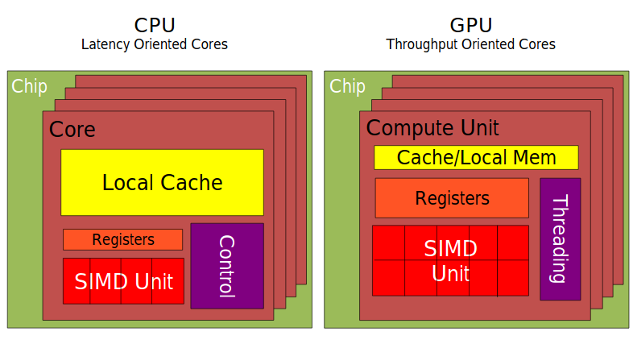
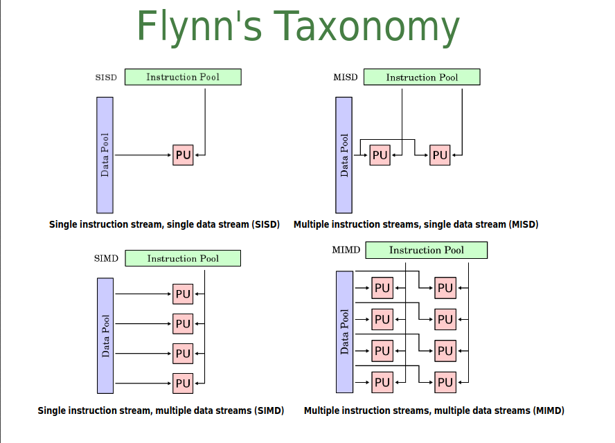

# Intro to GPU programming

## Module 1

### Objectives
>1. To learn the major differences between latency devices (CPU cores) and throughput devices (GPU cores)
>2. To understand why high-performance applications increasingly use both types of devices

### Von-Neumann architecture
* basis for most modern computers (parallel processors and a few other unique architectures use a different model)
* hardware consists of 3 units:
  * CPU (control unit, ALU, registers)
  * memory (stores programs and date)
  * I/O system (including secondary storage)
* Harvard architecture extends VNA by adding non-voltaile ROM.
  * volatile memory is computer storage that only maintains its data while the device is powered. RAM is volatile.

### CPUs are latency oriented design
* powerful ALU to reduce operation latency
* large caches to speed up memory access
* sophisticated control
  * branch prediction for reduced branch latency
    * branch prediction is a technique used in CPU design that attempts to guess the outcome of a conditional operation and prepare for the most likely result.
  * data forwarding for reduced data latency
* primary functions of a CPU:
  * Fetching
  * Decoding
  * Executing
  * Writeback
* two types of architectures:
  * Complex Instruction Set Computing (CISC)
    * Examples include Intel 80x86, AMD x86
    * single instruction can execute several low-level operations
    * capable of multi-step operations or addressing modes within single instructions
    * generally instructions take more than 1 clock to execute
    * instruction of variable size
    * no pipelining
    * upward compatible within a family
    * microcode control
    * work well with simpler compiler
  * Reduced Instruction Set Computing (RISC)
    * Examples include ARM and AVR
    * require fewer transistors than CISC
    * reduces costs, heat and power use
    * desirable for light, portable, battery-powered devices
    * instructions execute in one clock cycle
    * uniformed length instructions and fixed instruction format
    * pipelining
    * instruction set is orthogonal
    * hardwired control
    * complexity pushed to the compiler
* single-thread performance optimization
* transistor space dedicated to complex instruction level parallelism (ILP)
* few die surface for integer and fp units

### GPUs are throughput oriented
* small caches to boost memory throughput
* simple control
  * no branch prediction
  * no data forwarding
* energy efficient ALUs
  * many long latency but heavily pipelined for high throughput
* requires massive number of threads to tolerate latencies
  * threading logic
  * thread state
* CUDA processor

  

* hundreds of simpler cores
  * thousands of concurrent hardware threads
* maximize floating-point throughput
* most die surface for integer and fp units

## Module 2

### Objectives
>1. To learn the main venues and developer resources for GPU computing
>2. Introction to CUDA C
>3. To lean the basic API functions in CUDA host code
>4. To learn about CUDA threads, the main mechanism for exploiting of data parallelism

### Accelerating applications
* three ways:
  * libraries: easy to use and most performance
  * compiler directives: easy to use and portable code
  * programming languages: most performance and most flexibility
    * CUDA C fits here!

### CUDA memory
* Device code can:
  * read/write per-thread *registers*
  * read/write all-shared *global memory*
* `​cudaError_t cudaMalloc ( void** devPtr, size_t size )` allocates an object in the device global memory
* `​cudaError_t cudaFree ( void* devPtr ) ` frees object from device global memory
* `​cudaError_t cudaMemcpy ( void* dst, const void* src, size_t count, cudaMemcpyKind kind )` for memory transfer

### CUDA Threads
* CUDA kernel is executed by a grid of threads
  * all threads in a grid run the same kernel code (Single Program Multiple Data)
  * each thread has indices that it uses to compute memory addresses and make control decisions
  * `i = blockIdx.x * blockDim.x + threadIdx.x`
* divide the grid into multiple blocks
  * threads within a block cooperate via shared memory, atomic operations and barrier synchronization
  * threads in different blocks do not interact
* a grid is a collection of thread blocks of the same thread dimensionality which all execute the same kernel, threads are oganized in blocks
* a block is executed by a multiprocessing unit
* threads of a block can be identified using 1D, 2D, or 3D
* blocks may be indexed in 1D, 2D, or 3D.
* threads in a block can communicate via shared memory
* kernel is launched by the following code:
  * `myker <<< numBlocks, threadsPerBlock >>>( /* params */ );`
* (SM) Streaming multiprocessors
  * each block can execute in any order relative to other blocks
  * 