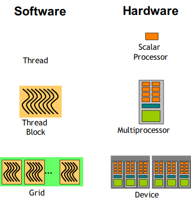
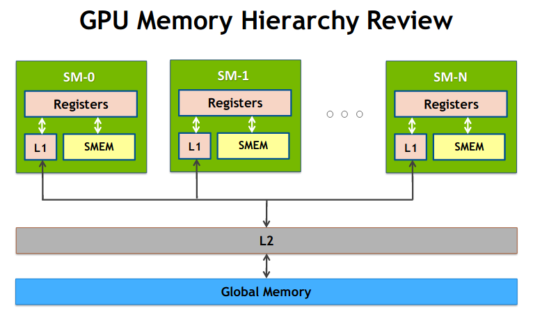

# Intro to GPU programming

## Module 1

### Objectives
>1. To learn the major differences between latency devices (CPU cores) and throughput devices (GPU cores)
>2. To understand why high-performance applications increasingly use both types of devices

### Von-Neumann architecture
* basis for most modern computers (parallel processors and a few other unique architectures use a different model)
* hardware consists of 3 units:
  * CPU (control unit, ALU, registers)
  * memory (stores programs and date)
  * I/O system (including secondary storage)
* Harvard architecture extends VNA by adding non-voltaile ROM.
  * volatile memory is computer storage that only maintains its data while the device is powered. RAM is volatile.

### CPUs are latency oriented design
* powerful ALU to reduce operation latency
* large caches to speed up memory access
* sophisticated control
  * branch prediction for reduced branch latency
    * branch prediction is a technique used in CPU design that attempts to guess the outcome of a conditional operation and prepare for the most likely result.
  * data forwarding for reduced data latency
* primary functions of a CPU:
  * Fetching
  * Decoding
  * Executing
  * Writeback
* two types of architectures:
  * Complex Instruction Set Computing (CISC)
    * Examples include Intel 80x86, AMD x86
    * single instruction can execute several low-level operations
    * capable of multi-step operations or addressing modes within single instructions
    * generally instructions take more than 1 clock to execute
    * instruction of variable size
    * no pipelining
    * upward compatible within a family
    * microcode control
    * work well with simpler compiler
  * Reduced Instruction Set Computing (RISC)
    * Examples include ARM and AVR
    * require fewer transistors than CISC
    * reduces costs, heat and power use
    * desirable for light, portable, battery-powered devices
    * instructions execute in one clock cycle
    * uniformed length instructions and fixed instruction format
    * pipelining
    * instruction set is orthogonal
    * hardwired control
    * complexity pushed to the compiler
* single-thread performance optimization
* transistor space dedicated to complex instruction level parallelism (ILP)
* few die surface for integer and fp units

### GPUs are throughput oriented
* small caches to boost memory throughput
* simple control
  * no branch prediction
  * no data forwarding
* energy efficient ALUs
  * many long latency but heavily pipelined for high throughput
* requires massive number of threads to tolerate latencies
  * threading logic
  * thread state
* CUDA processor

  

* hundreds of simpler cores
  * thousands of concurrent hardware threads
* maximize floating-point throughput
* most die surface for integer and fp units

## Module 2

### Objectives
>1. To learn the main venues and developer resources for GPU computing
>2. Introction to CUDA C
>3. To lean the basic API functions in CUDA host code
>4. To learn about CUDA threads, the main mechanism for exploiting of data parallelism
>5. To familiarize with some tools from the CUDA toolkit including compiler flags, debuggers and profilers

### Accelerating applications
* three ways:
  * libraries: easy to use and most performance
  * compiler directives: easy to use and portable code
  * programming languages: most performance and most flexibility
    * CUDA C fits here!

### CUDA memory
* **Device** code can:
  * read/write per-thread *registers*
  * read/write all-shared *global memory*
* `​cudaError_t cudaMalloc ( void** devPtr, size_t size )` allocates an object in the device global memory
* `​cudaError_t cudaFree ( void* devPtr ) ` frees object from device global memory
* `​cudaError_t cudaMemcpy ( void* dst, const void* src, size_t count, cudaMemcpyKind kind )` for memory transfer

### CUDA Threads
* CUDA kernel is executed by a grid of threads
  * all threads in a grid run the same kernel code (Single Program Multiple Data)
  * each thread has indices that it uses to compute memory addresses and make control decisions
    * `i = blockIdx.x * blockDim.x + threadIdx.x`
* **blocks**: divide the grid into multiple blocks
  * threads within a block cooperate via 
    * shared memory
    * atomic operations
    * barrier synchronization
      * a barrier for a group of threads in the source code means any thread must stop at this point and cannot proceed until all other threads reach this barrier.
  * threads in different blocks do not interact
* a grid is a collection of thread blocks of the same thread dimensionality which all execute the same kernel, threads are oganized in blocks
* a block is executed by a multiprocessing unit
* threads and blocks can be indexed using 1D, 2D, or 3D
* threads in a block can communicate via **shared memory**
* kernel is launched by the following code:
  * `myker <<< numBlocks, threadsPerBlock >>>( /* params */ );`
### Streaming multiprocessors
* performs the actual computation
* Each SM has its own:
  * control unit
  * registers
  * execution pipelines
  * caches
  * shared memory
  * L1 cache
* many architecture-dependent CUDA cores per SM
* each block can execute in any order relative to other blocks
* threads are assigned to SMs in block granularity
  * up to 8 blocks to each SM as resource allows
* threads run concurrently
  * SM maintains thread/block IDs
  * SM manages/schedules thread execution

### Execution model

* threads are executed by scalar processors
* thread blocks are executed on multiprocessors
  * several concurrent threads can reside on one multiprocessor
* a kernel is launched as a grid of thread blocks

### GPU Memory hierarchy summary

### Thread scheduling
* SM implements **zero-overhead** warp scheduling
* at any time, only one of the warps is executed by the SM.
* warps whose next instruction has its operands ready for consumption are eligible for execution
* eligible warps are selected for execution on a prioritized scheduling policy.
* all threads in a warp execute the same instruction when selected
* Fermi GPUs implement a double warp scheduler
  * each SM has two warp schedulers and two instruction units
* all threads in the same warp execute the same code independently (except for explicit synchronization) by run-time scheduler

### Warps
* each block consists of 32-thread warps
  * in a block of threads, the threads are executed in groups of 32, called a **warp**. If the size is not divisible by 32, some of the threads in the last warp will remain idle.
* a warp is executed physically in parallel (single instruction multiple threads)
* warps are scheduling units in SM
* if 3 blocks are assigned to an SM and each block has 256 threads, how many warps are there in an SM?
  * each block is divided into 256 / 32 = 8 warps. Hence, 3 blocks have $8 \times 3 = 24$ warps.
* **all threads must be executed before there is space to schedule another thread block**
* if the blocks are 2D or 3D, the threads are **ordered by dimension**.
* **Important:** knowing the number of threads in a warp becomes important to maximize performance of the program. Performance may be lost otherwise:
  * **avoid idle threads**
    * in the kernel invocation, `<<< blocks, threads >>>`, try to choose a number of threads that divides evenly with the number of threads in a warp (usually a multiple of 32).
  * **avoid warp divergence**
    * in your kernel, try to have each thread follow the same code path. Otherwise warp divergence can occur. This happens because the GPU has to run the entire warp through each of the divergent code paths.
  * **consistent loading and storing**
    * in your kernel, try to have each thread in a warp load and store data in specific patterns. For instance, have the threads in a warp access consecutive 32-bit words in global memory.
* ALUs (cores), load/store units (LD/ST) and Special Function Units (SFU) are pipelined units. They keep the results of many computations or operations at the same time, in various stages of completion.
* So, in one cycle they can accept a new operation and provide the results of another operation that was started a long time ago (~20 cycles for the ALUs).
* So, a single SM has resources for processing 48*20 cycles = 960 ALU operations at the same time, which is 960 / 32 threads = 30 warps.
* In addition, it can process LD/ST operations and SFU operations at whatever their latency and throughput are.
* Warp schedulers can schedule 2 * 32 threads per warp = 64 threads to the pipeline per cycle.
* At any given cycle, the warp schedulers try to "pair up" two warps to schedule, to maximize SM utilization. These warps can be either from different blocks or different places in the same block.
* Warps that are executing instructions for which there are fewer than 32 resources, must be issued multiple times for all threads to be serviced.
  * For instance, there are 8 SFUs, so that means that a warp containing an instruction that requires the SFUs must be scheduled 4 times.

### Parallel Thread Execution (PTX)
* PTX provides a stable programming model and instruction set for general purpose parallel programming.
* It is design to be efficient on NVIDIA GPUs supporting the computation features defined by the NVIDIA Tesla architecture.
* High-level language compilers for languages such as CUDA and C++ generate PTX instructions, which are optimized for and translated to native target-architecture instructions.

### NVCC Compiler
* Cuda-C compiler
* compiles device code then forwards code on to the host compiler
* can be used to compiler and link host-only applications

### CUDA-GDB
* extension of GDB to provide seamless debugging of CUDA and CPU code

## Module 3
TODO: Finish lecture 3-5 notes

## Module 4

## Module 5

### Objectives
>1. To understand how CUDA threads execute on SIMD hardware

### Warps
* each block is divided into 32-thread warps
  * an implementation technique
  * warps are scheduling units in SM
  * threads in a warp execute in SIMD manner
  * number of threads in a warp may vary in future generations
* blocks are partitioned after linearization
  * linearized thread blocks are partitioned
  * partition scheme is consistent across devices
  * do not rely on any ordering within or between warps

